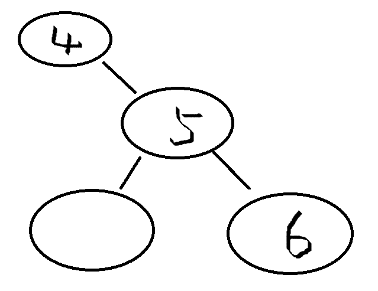
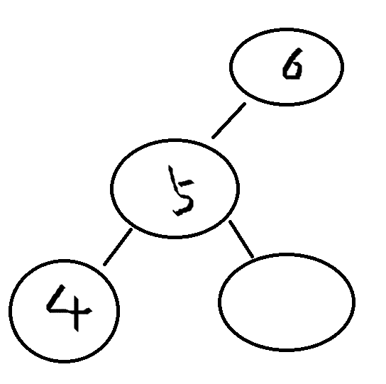
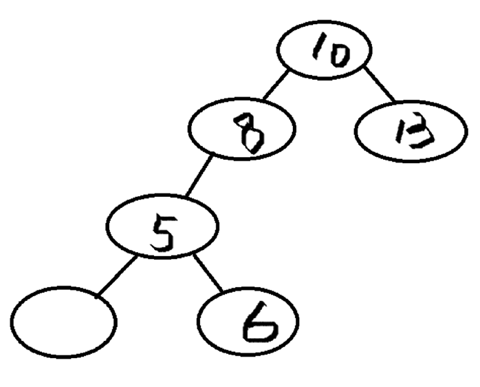
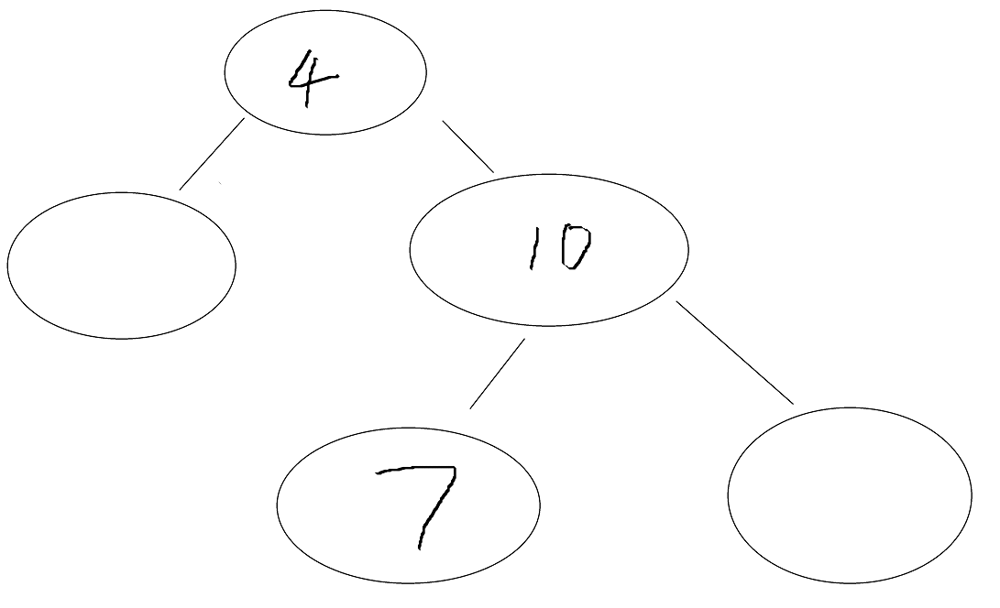

# 平衡二叉树
## 特点
* 高度平衡：平衡二叉树中的每个节点的两个子树的高度差不超过1。  
  
* 二叉排序树：平衡二叉树必须是一个二叉排序树，这意味着对于树中的每个节点，其左子树中的所有节点值都小于该节点的值，而右子树中的所有节点值都大于该节点的值。
  
## 判断调整类型  
- 找到失衡树的根节点
- 导致树失衡的节点
- 在根节点的哪一侧

## 基本调整类型
- RR
  - 取中间的节点，让根节点变成它的左节点，如果节点本身有左节点的话，将节点本身的左节点变成根节点的右节点。
  
- LL
  - 取中间节点,将根节点作为自己的右节点，如果节点本身就有右节点，将自己的右节点变成根节点的左节点。
  
- LR
  - 取导致树失衡的节点，作为根节点，将导致失衡的节点的根节点变成自己的左节点，将（导致失衡的节点）的（根节点）的根节点变成自己的右节点。  
   
- RL
  - 取导致树失衡的节点，作为根节点，将导致失衡的节点的根节点变成自己的右节点，将（导致失衡的节点）的（根节点）的根节点变成自己的左节点。
  

## 代码
- 建立平衡二叉树过程本质上是建立排序二叉树，在建立的过程中不断地进行调整